## Agenda

- Tour of Jornada datasets
- Finding Jornada data
  - JRN data catalog
  - Data viewer
  - EDI repository portal
  - Jornada GeoPortal
  - Other
- Accessing and using Jornada data (hands-on)
  - Web access (website, EDI, GeoPortal)
  - EDIutils
  - Other

## A little background

- Jornada Basin has been an intensive research site for a long time.
- Jornada Experimental Range (JER), established in 1912
- Jornada Basin LTER (JRN), established in 1982
- Many other programs collect, or have collected, data in the Jornada Basin.

  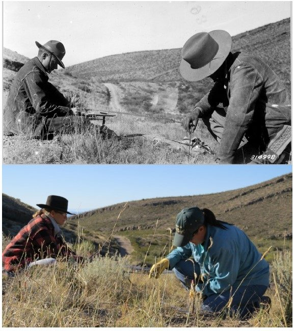

## Here are a few…

  
  
  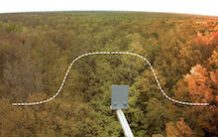
  
  
  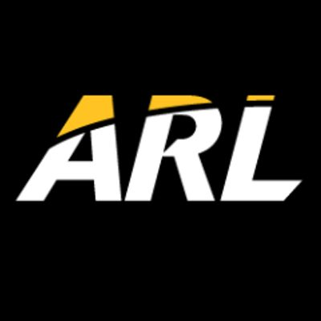
  

## Data collection, management, and use have evolved

- People, their studies and research priorities turn over
- Funding for programs can be unsteady
- As researchers, we’re not always perfect about data management
- Open data is a relatively new priority
- Managing and curating Jornada data is a continual work in progress…

  

## Our objectives today

- Learn what Jornada data are available and how they can be used in your research.
- Get practical experience working with Jornada data.
- Please take time to do the activities and ask questions. We are learning by doing!

## Get ready

- Visit [jornada-im.github.io](http://jornada-im.github.io) and find the workshop page. Slides and communal notes are available here.
- Make a workshop folder on your laptop to download data.
- Open up your favorite data analysis platform (R, Excel, etc.) and a GIS program if you want.

## How do we classify Jornada data?

- **Core:** long-term datasets collected or directly supported by JRN and JER research staff
- **Contributed:** shorter term (usually) datasets collected by any researchers funded by, or formally affiliated with, JRN and/or JER
- **Partner:** datasets collected by external partners, like other federal agencies or research networks.
- Core and contributed datasets are further organized by 3 digit **study ID:**
- **210011001 = site manager, study ID, dataset ID**

## How do we classify Jornada data?

- **Core:** long-term datasets collected or directly supported by JRN and JER research staff
- **Contributed:** shorter term (usually) datasets collected by any researchers funded by, or formally affiliated with, JRN and/or JER
- **Partner:** datasets collected by external partners, like other federal agencies or research networks.
- Core and contributed datasets are further organized by 3 digit **study ID:**
- **210011001 = site manager, study ID, dataset ID**
- Not everything fits cleanly into this scheme
- Synthesis and remote sensing data don’t receive a study ID
- Occasionally we republish **partner** data with Jornada study IDs

## We also classify by research themes or data types

- For today:
- Long term vegetation data
- Weather and climate
- Geospatial data (GIS)
- Remote sensing & airborne imagery
- **Vegetation dynamics**
- **Climate & environmental monitoring**
- **Management & restoration**
- **Biogeochemistry**
- **Hydrology**
- **Aeolian processes**
- **Trophic interactions**
- **Physical geography & soils**
- **Sensor network data**
- **Remote sensing**
- **Modeling**
- **Sequencing/microbiome**
- **Animals**
- **EC fluxes**

## Long-term vegetation data

- Primary production
- Cover

## Primary production data

- Biomass or carbon accumulation by primary producers (plants, usually)
- **Variable:** Gross or net primary production, aboveground or belowground
- **Units:** _g biomass · m-2 · day -1_ or _g C · m-2 · day -1_

## Jornada NPP: a non-destructive NPP method for drylands

- 1m2 long-term quadrats installed at 15 Jornada sites in 1989
- Field datasets:
- Replicate species harvests (dimensions & biomass)
- Plant dimensions (only) collected in long-term quadrats
- Allometric method to estimate biomass
- Huenneke, Clason, and Muldavin described the method in 2001

  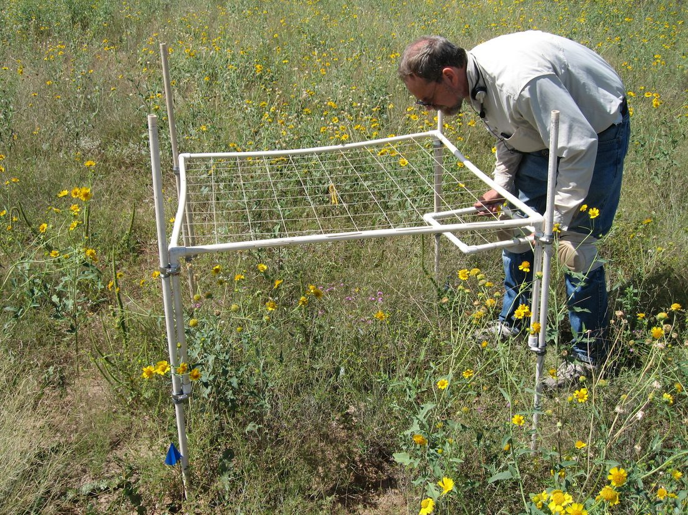
  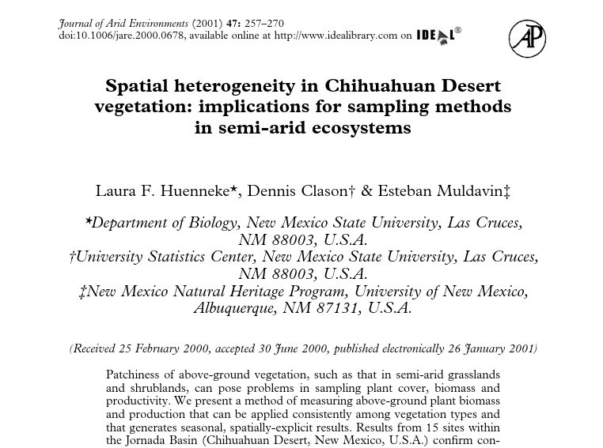

## Used in numerous JRN pubs & cross-site syntheses

- NPP sites anchor many other Jornada studies
- Meteorology, soil profile characterization, soil water/temperature, plant traits, aerial photos, terrain/elevation models, phenology, animal studies, short-term grad student projects
- Validating new research methods (UAV/Remote sensing, models)

  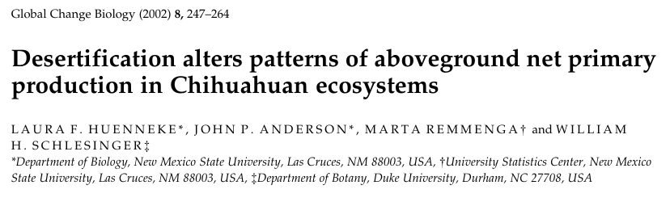
  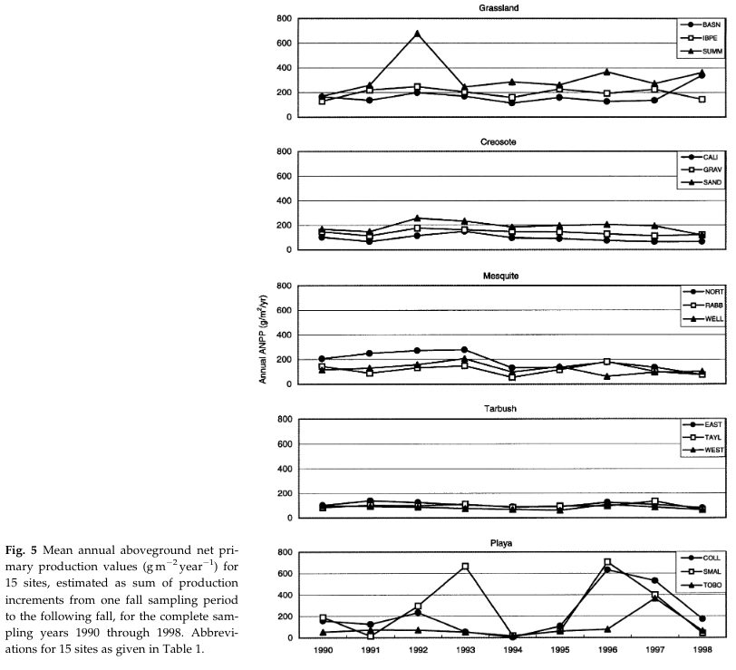

## Jornada ANPP data

- Jornada NPP study sites (15 sites)
- Ecotone project (Bestelmeyer - 5 sites)
- Global change experiment (Sala - 1 site, slightly different method)
- **Variable names differ, same units, same temporal resolution**
- Red = 15 NPP sites; Orange = Ecotone, Green = GlobalChange

  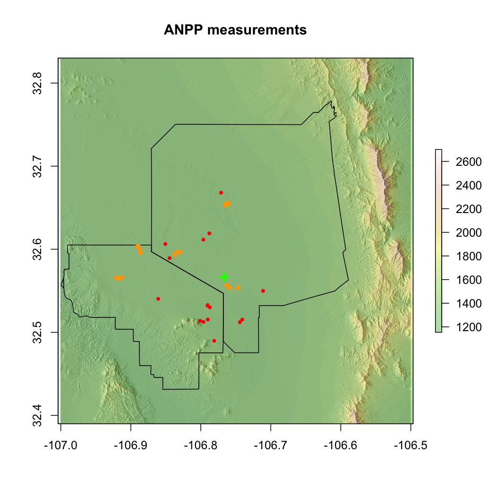

## Other datasets about production

- Eddy covariance fluxes (NEE, partitioned fluxes)
- Belowground NPP (root biomass production) - not common but not unheard-of

## Plant cover

- Cover of plant species of functional type in an area.
- **Variable:** percent or fractional cover
- **Units:** _dimensionless_

## Jornada permanent quadrats

- Plant type, cover, and density measured since 1915
- Yearly to 1970s, break until early 90s, resuming at 5-year frequency
- 122 locations across the Jornada Experimental Range

  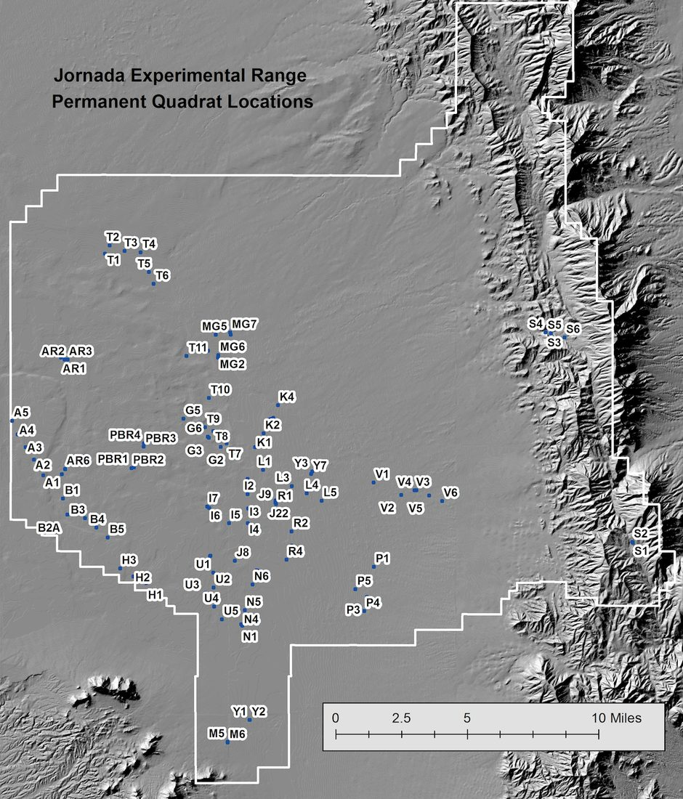

## Useful for assessing long-term vegetation change

- such as grass-shrub transitions
- Also, potentially useful for biodiversity research

  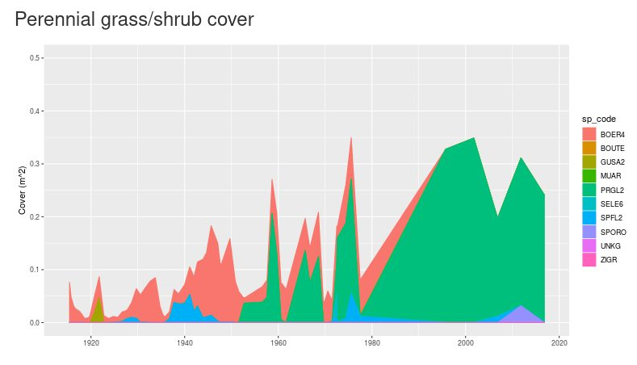

## Jornada quadrat cover data

- Jornada permanent quadrats (122, starting 1915)
- Ecotone quadrats (5, starting 2005)
- SMES (2, starting 1995)
- Different variable names, different units, different temporal resolution, different treatments
- Red = Perm Quads; Orange = Ecotone, Green = SMES

  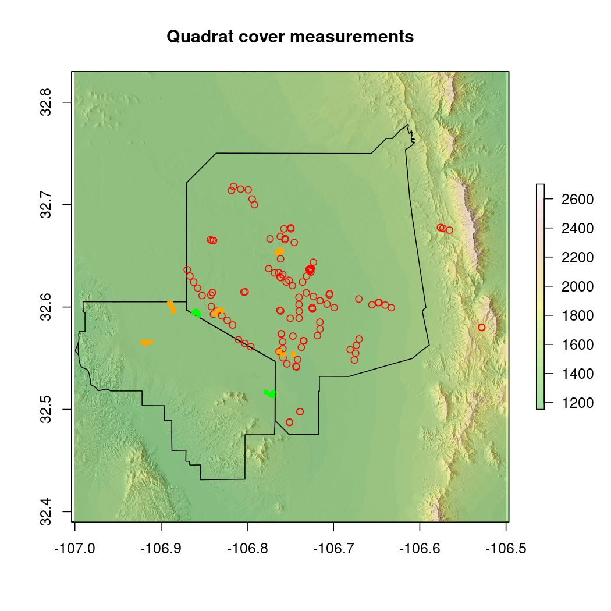

## More plant cover data…

- Gibbens 2005 vegetation maps
- Line-point intercept data from multiple projects
- Jornada LTER transect [knb-lter-jrn.210119001](https://portal.edirepository.org/nis/mapbrowse?scope=knb-lter-jrn&identifier=210119001)
- SMES [knb-lter-jrn.210086001](https://portal.edirepository.org/nis/mapbrowse?scope=knb-lter-jrn&identifier=210086001)
- ConMod pilot [knb-lter-jrn.210308002](https://portal.edirepository.org/nis/mapbrowse?scope=knb-lter-jrn&identifier=210308002)

  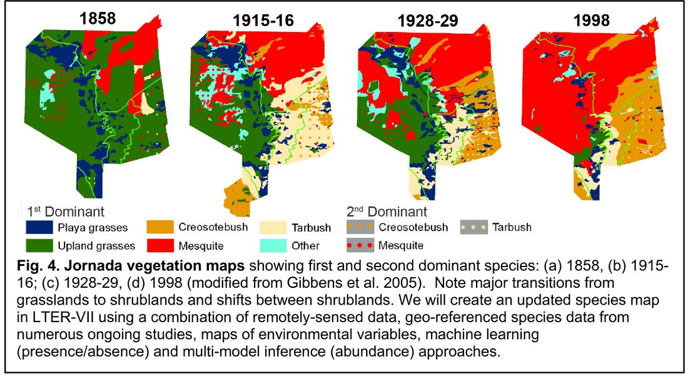

## Weather and climate

- Jornada met stations
- Rain gauges
- Soil moisture

## Meteorology data

- Data collected from weather stations, including air temperature and RH, wind speed/direction, and precipitation.

  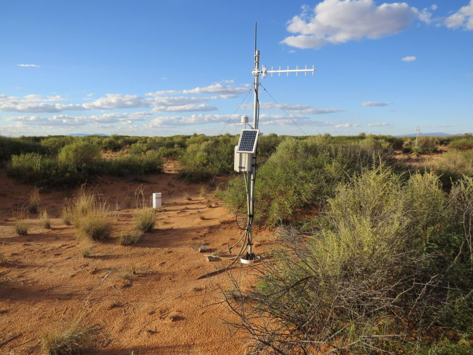

## Longest-term weather stations

- JER headquarters NOAA station. Collecting data 1914-present.
  - [Data available at NCDC](https://www.ncdc.noaa.gov/cdo-web/datasets/GHCND/stations/GHCND:USC00294426/detail)
  - There are other NOAA stations in the region with similar records
- LTER weather station. Collecting data 1983-present
  - [Data at EDI](https://portal.edirepository.org/nis/mapbrowse?scope=knb-lter-jrn&identifier=210126001)
  - Some data issues being worked on

## NPP and Cross-scale weather stations

- Collecting continuously since 2013, multiple frequencies
- Data are regularly quality assured and sent to EDI
- There are some estimated/gapfilled precipitation datasets (since 1989) too

  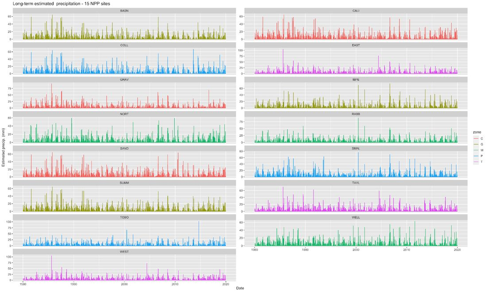

## Rain gauges

- There is a very extensive rain gauge network with multiple gauge types, varying temporal records. Rain is very unevenly distributed in NM.
- Monthly standard cans (cumulative)
- Weighing gauges
- Tipping-bucket (regular timeseries or event-based)
- Best practices is to ask the field crew or IM team which rain gauge

## Other meteorology data

- Several wind profile weather stations
- Individual experiments sometimes have their own rain gauge
- Eddy covariance towers
  - Tromble watershed, UTEP Bajada & Red Lake Playa on AmeriFlux
  - JER DuRP project towers (3)
  - Army research lab - 30+ EC towers

## Activity 1

- Lets practice finding a Jornada meteorology dataset on EDI. Visit the EDI data portal - [https://portal.edirepository.org](https://portal.edirepository.org) - and use the search function to look for a Jornada weather or climate dataset that might be useful to you. Put the link to a dataset you found in our notes document.

## Activity 1

- Lets practice finding a Jornada meteorology dataset on EDI. Visit the EDI data portal - [https://portal.edirepository.org](https://portal.edirepository.org) - and use the search function to look for a Jornada weather or climate dataset that might be useful to you. Put the link to a dataset you found in our notes document.
- Were you successful? Lets look at [an example](https://portal.edirepository.org/nis/mapbrowse?packageid=knb-lter-jrn.210437007.44).

## Soil water at NPP sites

  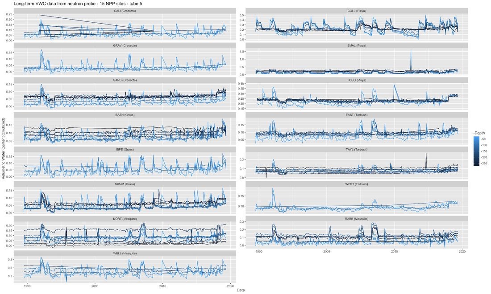

## Soil moisture data

- NPP and CSIS sites have automated soil profile sensors (VWC, T, EC) since 2013
- Long-term neutron probe data since 1989 (NPP sites and more)
- Many experiments have their own instrumentation or probe data

  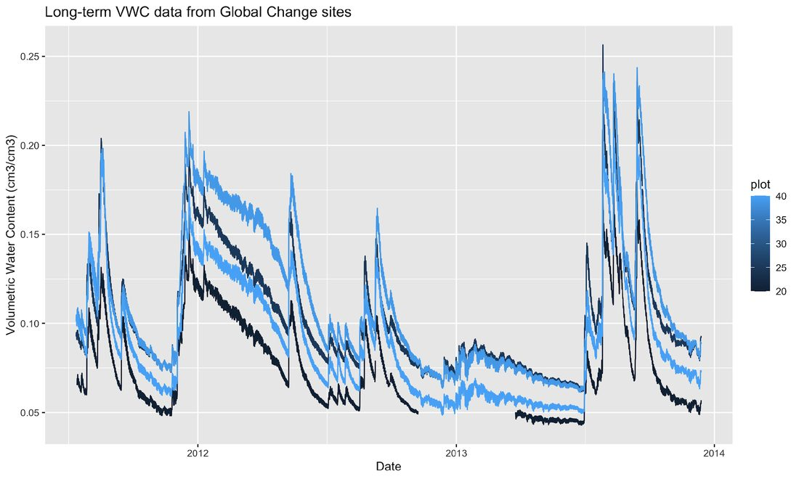

## Spatial data (GIS)

- Vector and raster datasets about Jornada Basin
- Research locations

## What are spatial data & GIS?

- **(Geo)spatial data:** Any data with location or geographic coordinates attached to the observation
- **Geographic information systems (GIS):** Integrated computer hardware and software that store, manage, analyze, edit, output, and visualize geographic data

  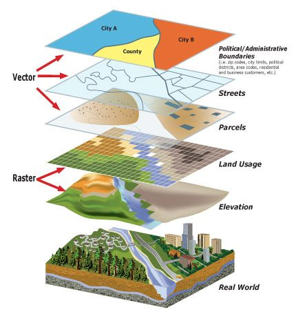

## Why do we care at the Jornada?

- Drylands are spatially heterogeneous
- We work in a large area
- We want to place our research in landscape context

  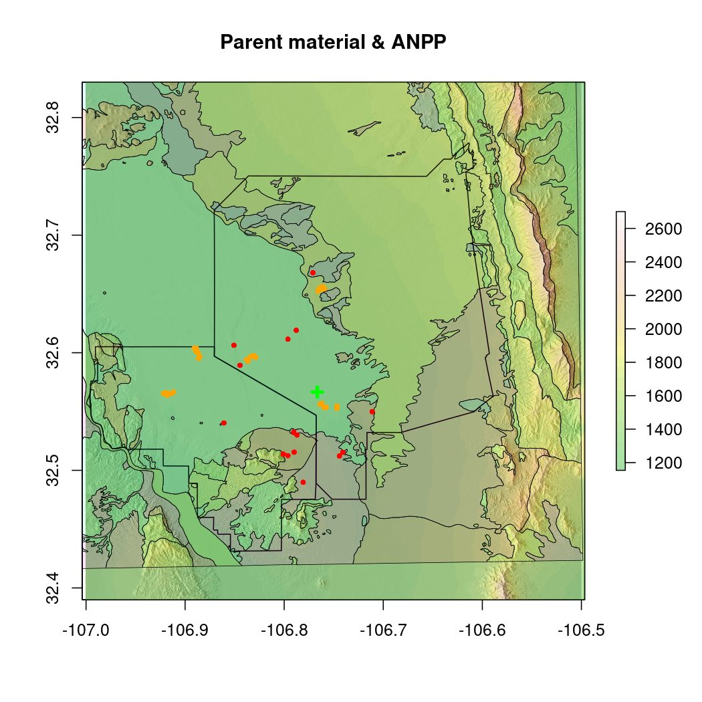

## The Jornada Spatial Data Catalog

- There are well over 1000 datasets
- Study & measurement locations
- Instrumentation, fences, roads, boundaries, buildings
- Physical geography
- Vegetation and soil survey products
- Remote sensing data
- Model outputs
- Only a small amount of datasets have been published or made accessible

  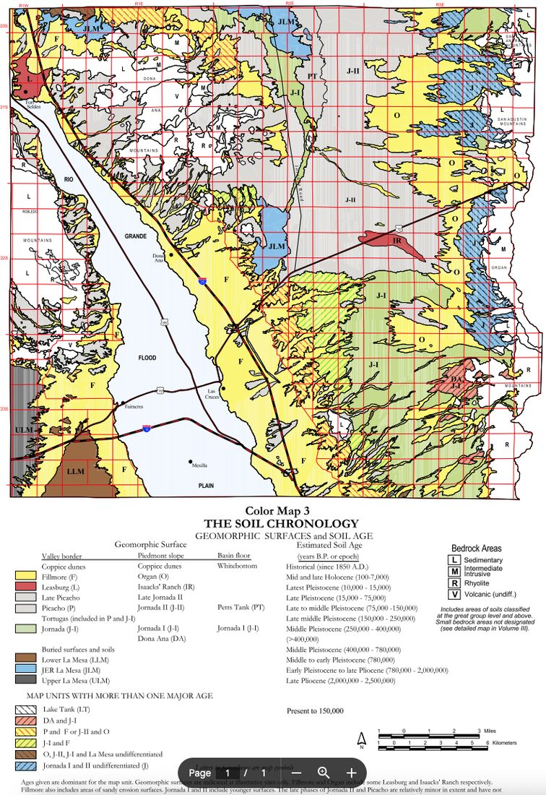

## How is it managed?

- Somewhat decentralized and siloed
- There are some great USDA GIS staff
- The LTER produces lots of data
- Researchers often manage their own pile of GIS data
- Some data are restricted access
- We are working out improved coordination and access methods
- A data commons is one goal…

  
  
  
  

## How do I find spatial data?

- The [LTER website](https://lter.jornada.nmsu.edu) lists public layers
- The [Jornada GeoPortal](https://jornada-geoportal-nmsu.hub.arcgis.com/) is our current “enterprise GIS” system
- Some spatial datasets are published to EDI
- Ask someone!
- Amy Slaughter ([amalia.slaughter@usda.gov](mailto:amalia.slaughter@usda.gov))
- Greg Maurer ([gmaurer@nmsu.edu](mailto:gmaurer@nmsu.edu))
- John Anderson, Darren James, Scott Schrader

## Data:

- Datasets in public repositories
- Real-time data
- Spatial data from the Jornada GeoPortal
- **https://lter.jornada.nmsu.edu**

  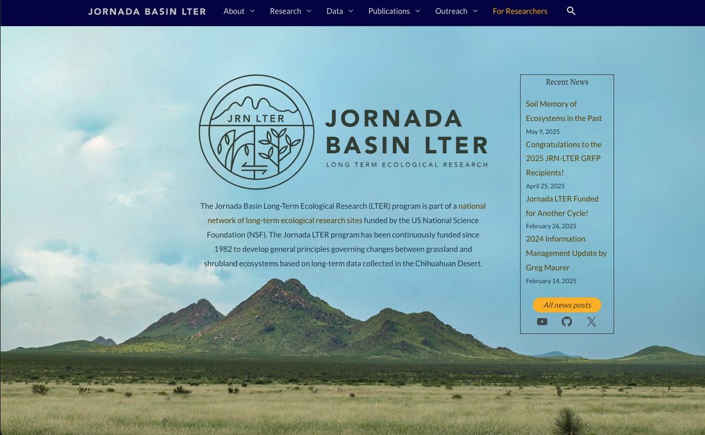

## The Jornada GeoPortal

- [https://jornada-geoportal-nmsu.hub.arcgis.com/](https://jornada-geoportal-nmsu.hub.arcgis.com/)
- This is a new, under-construction system
- Based on ArcGIS Online (AGOL), provided by NMSU
- All previously available GIS layers are there now
- Restricted layers available on login (request access)
- Permissions management is important for spatial data

  

## How data are categorized and made searchable

  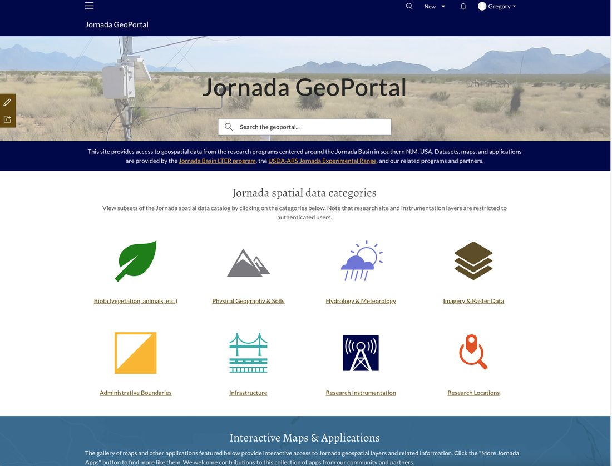

## Online interaction with spatial data

- Maps, web apps, “StoryMaps”, etc.
- [Here is a basic map](https://experience.arcgis.com/experience/6ce49f3f2ff941429b15d50e7a46b466) of the Jornada’s spatial data
- With an account you can log in and create these yourself

  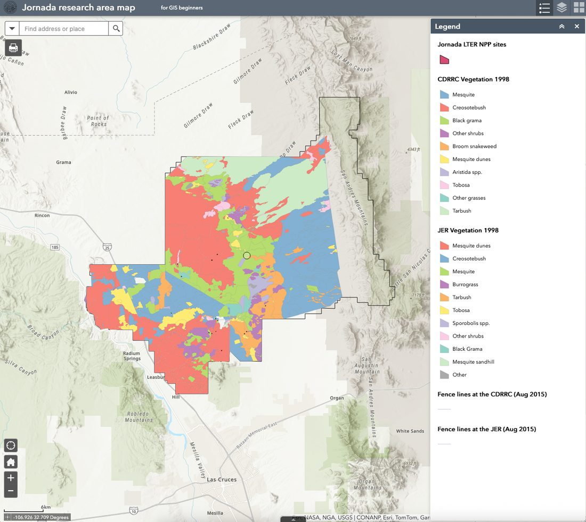

## Activity 2: Lets go find and download spatial data!

- Visit the Jornada GeoPortal to find:
- Boundaries of JER and CDRRC
- Soil and vegetation survey layers (JER/CDRRC 1998)
- NPP plot locations
- Then, load them up in your favorite GIS application.

## Activity 2: Lets go find and download spatial data!

- Visit the [Jornada GeoPortal](https://jornada-geoportal-nmsu.hub.arcgis.com/) to find:
- Boundaries of JER and CDRRC
- Soil and vegetation survey layers (JER/CDRRC 1998)
- NPP plot locations
- Then, load them up in your favorite GIS application.
- Where did you encounter trouble?

## Join the JornadaGIS_users group

- There is more data available to authenticated users!
- Steps to get access:
- Make an AGOL account - institutional or [public](https://doc.arcgis.com/en/arcgis-online/get-started/create-account.htm#ESRI_SECTION1_D91DD2A709AE4FB68A9CC095F1688E05)
- Fill out the [Jornada Spatial Data Agreement](https://docs.google.com/forms/d/e/1FAIpQLSdJijSKE4C9G5pgB__yGelBx5j9OPBSKOoCg4MJP-eb-Isiew/viewform?usp=sf_link)
  - Submit your AGOL username in the form!
- I’ll add you to the group
- Keep in mind you are testing a new system…
- _Help wanted making nice maps!_

  

## Other data sources

- USGS:
- Earth Explorer: [https://earthexplorer.usgs.gov/](https://earthexplorer.usgs.gov/)
- The National Map: [https://apps.nationalmap.gov/downloader/](https://apps.nationalmap.gov/downloader/)
- NASA:
- Earthdata: [https://www.earthdata.nasa.gov/data/catalog](https://www.earthdata.nasa.gov/data/catalog)
- ESRI:
- Living Atlas of the World: [https://livingatlas.arcgis.com/en/home/](https://livingatlas.arcgis.com/en/home/)
- Daymet:
- Daily weather and climate: [https://daymet.ornl.gov/](https://daymet.ornl.gov/)

::: {.notes}
Can find satellite imagery  (Landsat, MODIS, Copernicus, etc) and most other layers you may need (elevation, Lidar, etc)
:::

## Remote sensing/aerial imagery

- Satellite/aerial imagery & derived products
- Drones and UAVs

## There is lots of remote-sensing data available

- NEON AOP covers part of the J. Basin
- NASA Earthdata: [https://www.earthdata.nasa.gov/data/catalog](https://www.earthdata.nasa.gov/data/catalog)
- Google Earth Engine: [https://earthengine.google.com/](https://earthengine.google.com/)
- Also check out: [https://gee-community-catalog.org](https://gee-community-catalog.org)
- JRN has a growing UAV program

## What is RAP?

- [https://rangelands.app](https://rangelands.app/)
- _Allred et al. 2021, 2025,  Jones et al. 2021_

  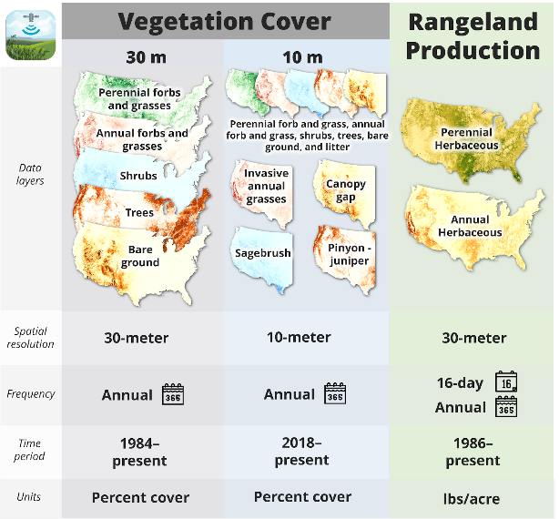
  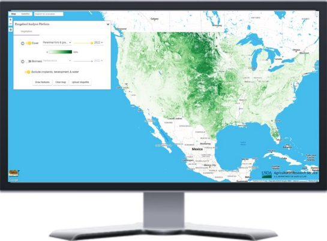
  
  
  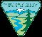
  
  
  
  
  
  
  

::: {.notes}
RAP is two things: 1) Remotely-sensed vegetation data, 2) a simple web application that puts this data at your fingertips for free.

Specifically, the data products include vegetation cover and production data layers representing various plant functional groups at various spatial scales and through time. Most data layers are available across the entire US.
:::

## Ways to access RAP

- **Data access**
- Web map: [https://rangelands.app/rap](https://rangelands.app/rap/)
- Google Earth Engine ImageCollection: ‘projects/rap-data-365417/assets/vegetation-cover-v3’
- Google Earth Engine Community Catalog [https://gee-community-catalog.org/projects/rap/](https://gee-community-catalog.org/projects/rap/)
- GeoTIFFS: [http://rangeland.ntsg.umt.edu/data/rap/rap-vegetation-cover/](http://rangeland.ntsg.umt.edu/data/rap/rap-vegetation-cover/)
- GIS Tiles: [https://rangelands.app/support/19-viewing-rap-data-in-your-gis](https://rangelands.app/support/19-viewing-rap-data-in-your-gis)
- Cloud Optimized GeoTIFFS (COGs) in GIS: [https://rangelands.app/support/20-analyzing-rap-data-in-your-gis](https://rangelands.app/support/20-analyzing-rap-data-in-your-gis)
- The _rapr_ R package: [https://humus.rocks/rapr/](https://humus.rocks/rapr/)

## Finding and using the data

- A garden of forking paths!

## Tab 1: Core long-term data

- Long-term data underpinning JRN LTER’s core research themes. Most of this is in EDI.

  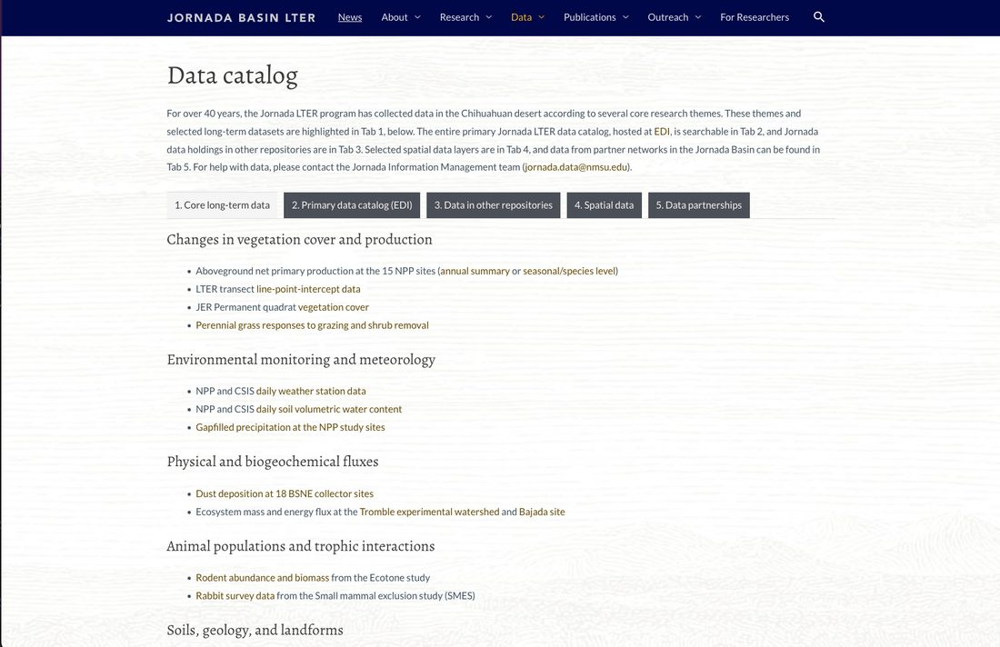

## Tab 2: Primary data catalog

- The full JRN LTER data catalog hosted by EDI repository. 366 datasets searchable by metadata fields here

  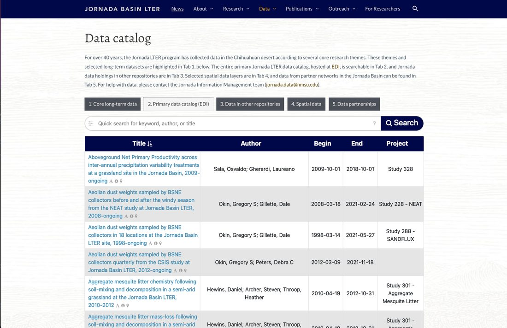

## Tab 3: Data in other repositories

- Search Jornada data holdings in other repositories (Dryad, NCBI, AmeriFlux). Includes citeable datasets & portals for partner networks. “Special” data types.

  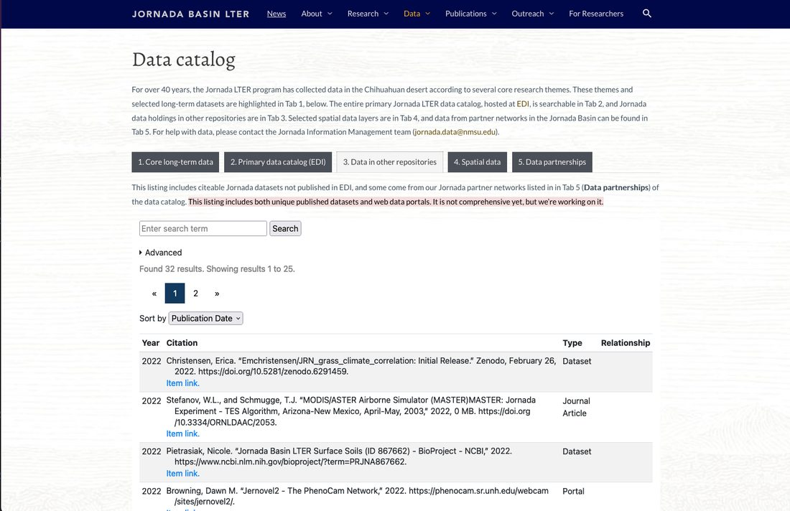

## Tab 4: Spatial data

- Selected geospatial/GIS datasets available for download. This is a small fraction of available spatial data.

  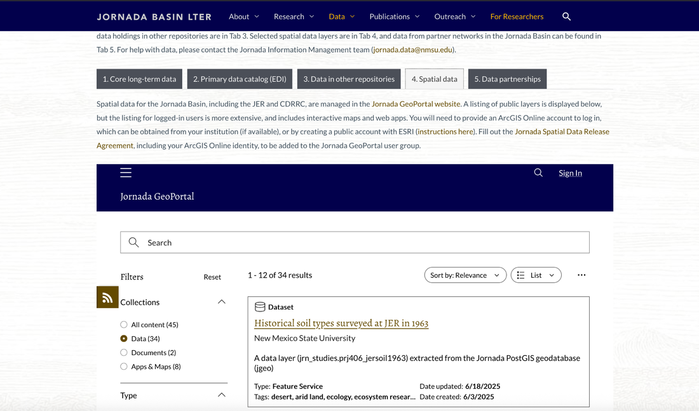

## Tab 5: Data partnerships

- Data from other research networks & agencies operating in the Jornada Basin. Some of these are in Tab 3 also.

  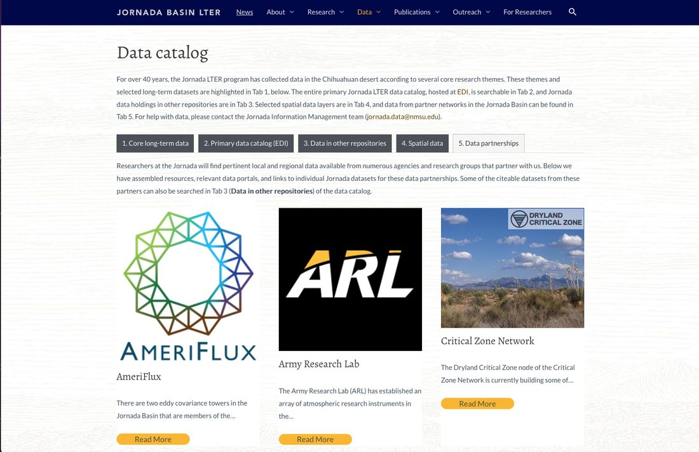

## Jornada data in

  

## Environmental Data Initiative repository (EDI)

- [https://edirepository.org](https://edirepository.org/)
- A “generalist” repository for LTER & other environmental data
- High quality, searchable metadata
- Most LTER datasets go here
- USDA datasets are increasingly going here too
- Searchable at EDI or **Tab 2**

  

## DeX

- Profile, subset and plot tabular datasets in EDI

  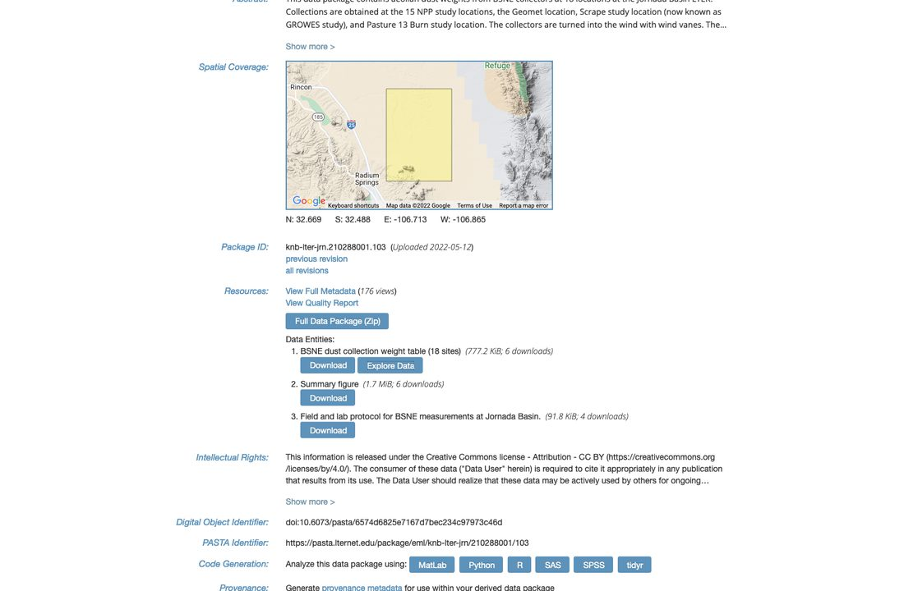
  

## EDIutils R package

- EDIutils - an API client for the EDI repository
- [https://docs.ropensci.org/EDIutils/](https://docs.ropensci.org/EDIutils/)
- Search/Access data in EDI
- Also has data management tools…
- There will be a quick demo….

  

## [DEMO – EDI & Jornada EDI catalog]

## Specialized Jornada data in other repositories

## Some data are special

- Specialized data is best archived with similar data
  - Nucleotide sequencing & genomic data
  - Eddy covariance (flux) data
  - Imagery data
- Shared data formats, variables, methods, or metadata standards
- Archived in **specialized data repositories**
- This data is supported by the JRN LTER, so we provide access
- Searchable in **Tab 3**, but less metadata available
- **PhenoCam**

  
  

## [DEMO – NCBI & AmeriFlux]

## Jornada geospatial data

## Spatial data are special too

- For “historical” reasons, Jornada geospatial data is not as open
- Selected data available through the [Jornada Geoportal](https://jornada-geoportal-nmsu.hub.arcgis.com/)
- The IM team can add you to the
- It is a good idea to also ask
  - The Jornada IM team ( [jornada.data@nmsu.edu](mailto:jornada.data@nmsu.edu), or [gmaurer@nmsu.edu](mailto:gmaurer@nmsu.edu) )
  - JER’s Amy Slaughter ( [amalia.slaughter@usda.gov](mailto:amalia.slaughter@usda.gov) )

## [DEMO - Jornada Geoportal]

## Partnerships and “other” Jornada data

## There is lots of other Jornada data

- We don’t directly manage ALL Jornada data
  - NEON
  - CZNet
  - Remote sensing data (NASA, USGS, Sentinel, etc)
  - NOAA & NRCS stations
  - Collections data (specimens & physical samples)
- We usually provide access via links to other data portals
- “Data Partnerships” are listed in **Tab 5** and some datasets/portals in **Tab 3**
- We can help - let us know what you are looking for!

  
  
  

## [DEMO – Partner data]

## More ways to explore Jornada data

## The Interactive data viewer

- R Shiny app showing met station locations (NPP & CSIS) and providing access to “provisional” met data.

  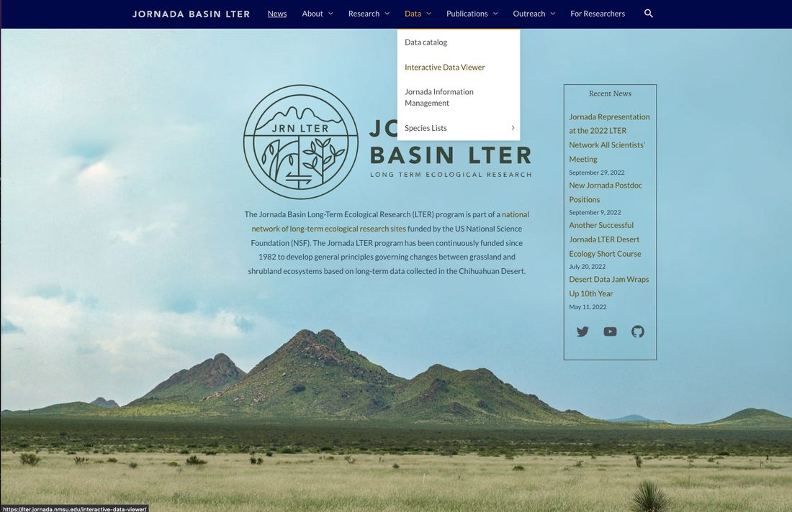

## Interactive data viewer

- Met data current to yesterday
- Subset & download data
- No QA/QC (!), but links to published data available
- Good for general orientation and answering the question “Did it rain at my site yesterday?”

  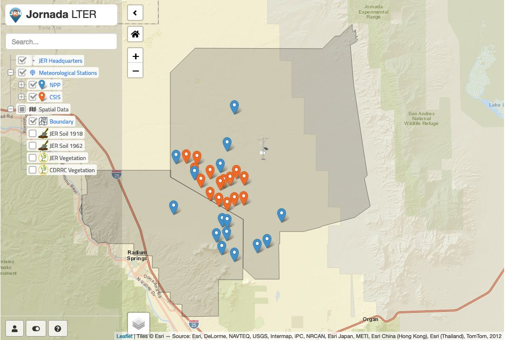

## [DEMO – Interactive data viewer]

## DataOne

- Metadata aggregator
- Many “member nodes”
  - All LTER repositories (EDI, BCO-DMO, ADC)
  - Dryad et al.
  - Some fed agency data
- Standard tabular datasets
- No NCBI, AmeriFlux, etc
- Good for cross-site synthesis, challenging for site-specific data

  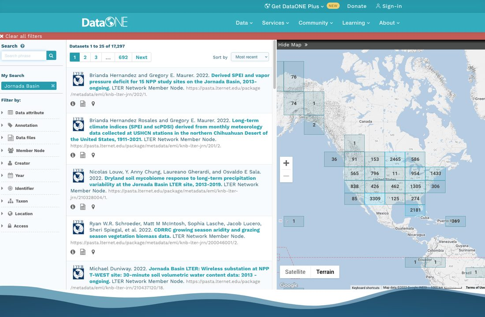

## Activity 3: What else is there?

- What have we missed here? Form small groups and discuss the kinds of data that are most useful in your research and whether you think you can find them given the information presented today. You can make notes in the community doc.
- Then, lets discuss.

## Using the data

- Hands on time!

