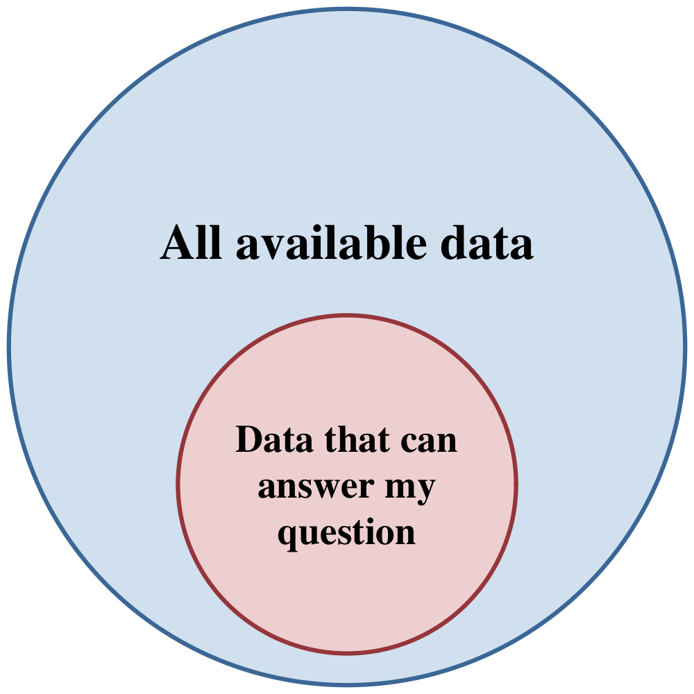
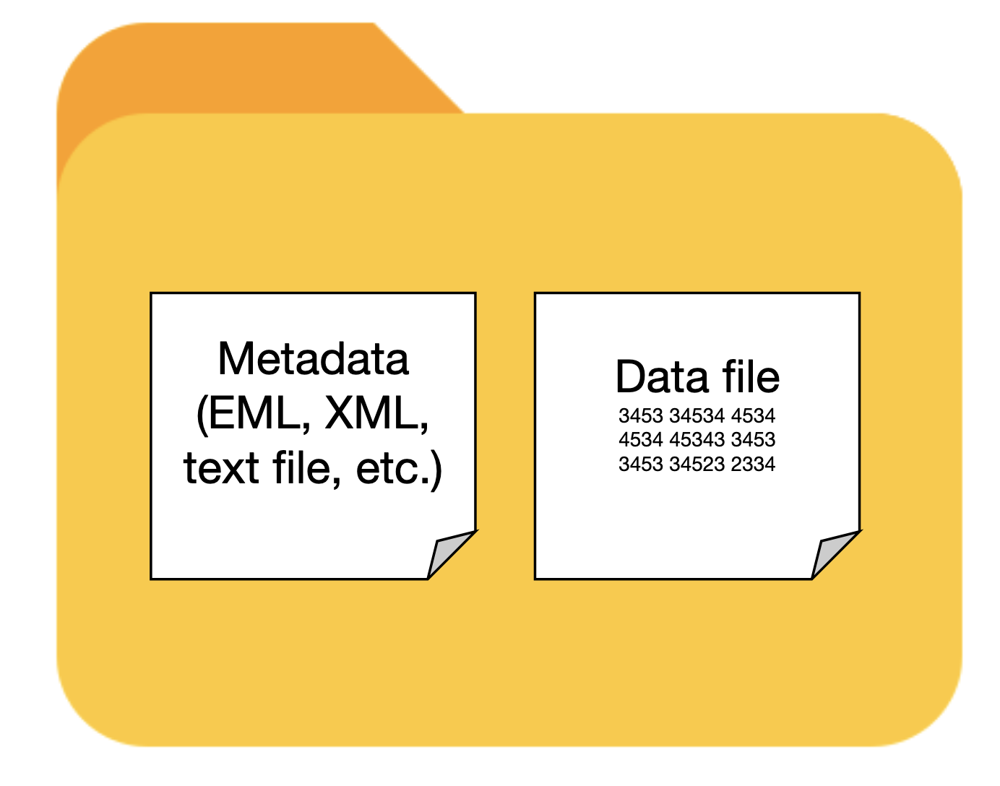
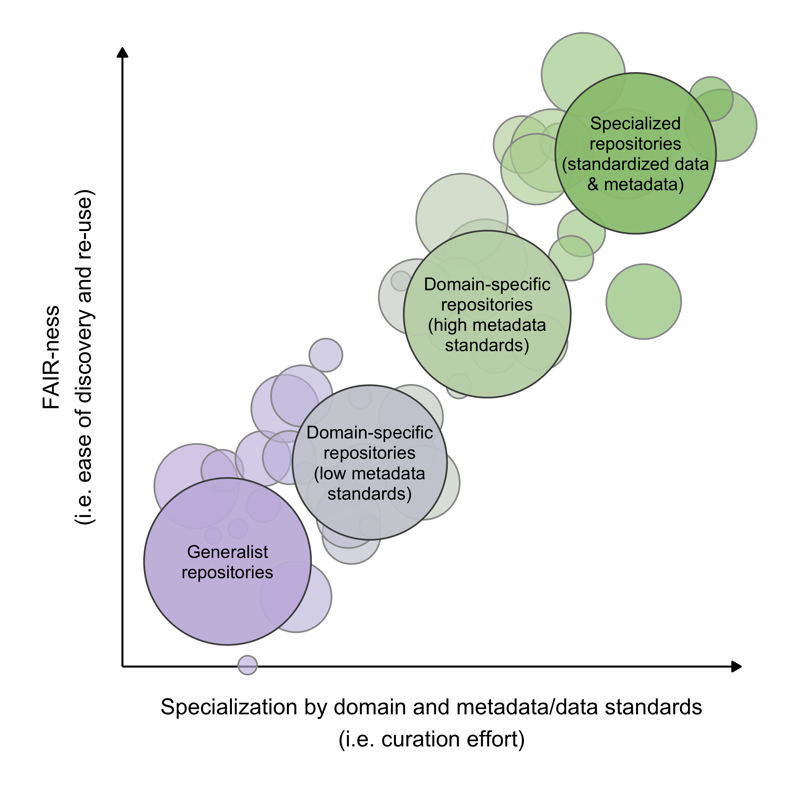
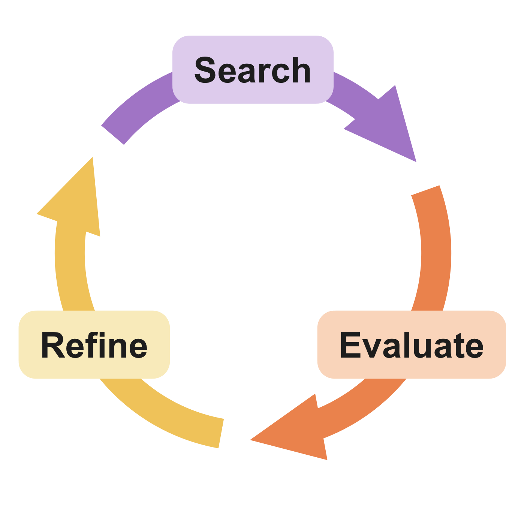

# Choosing search terms

## Learning objectives

- **Understand** the concepts and terms useful when searching for research data
- **Refine** your synthesis group's research question into the terms of a data query

## Synthesis starts with data discovery

{width=40% fig-align="center" fig-alt="A venn diagram with outer circle 'All available data' and inner circle 'Data that can answer my question'"}

- Synthesis questions are formulated with limited data in-hand
- The intent is to scale up to "all the available data"
- A clear research question maps directly to search criteria

## Questions and datasets share the same elements

- **Observational units** — a thing or phenomenon measured → *rows*
- **Variables** — an attribute that takes different values → *columns*

. . .

- **Groups** — treatments, taxonomic groups, functional types
- **Temporal dimensions** — when things happen, effect of time
- **Spatial dimensions** — where things happen, effect of location

## Mapping a question {.smaller}

> *Does species richness increase or decrease after disturbance?*

. . .

> Does variable X increase or decrease with time?

- **Variables:** species occurrence or richness (#)
- **Obs. units:** a community w/ known disturbance time
- **Groups:** _unspecified_ 
- **Temporal:** time since disturbance
- **Spatial:** _unspecified_ 

## Mapping a question {.smaller}

> *Are forests or deserts more sensitive to vapor pressure deficit?*

. . .

> Is group 1 or group 2 more strongly related to variable X?

- **Variables:** VPD, primary production (or similar)
- **Obs. units:** site meteorology & organisms/processes
- **Groups:** forest ecosystems, desert ecosystems
- **Temporal:** _unspecified (but probably)_
- **Spatial:** _unspecified_

## Mapping a question {.smaller}

> *Is the latitudinal gradient in small mammal body size changing?*

. . .

> Is the relationship between variable X and variable Y changing?

- **Variables:** body length or mass, capture location
- **Obs. units:** individual small mammals
- **Groups:** _unspecified_
- **Temporal:** at least two time periods
- **Spatial:** latitude gradient

## Activity {background-color="#fdf6e3"}

**With your group (10 min)**

Get into project groups and distill your research questions down to a conceptual mapping like the ones above. Once you have a conceptual map, answer these questions in your group's notes document:

1. What observational units is the group asking questions about?
2. What variables are of interest?
3. Are there any distinct groups to compare?
4. Is time or space important? If so, how?

## Activity {background-color="#fdf6e3"}

**Class discussion (5-10 min)**

Lets spend a few minutes comparing notes on potential search strategies.

- Were there any unresolved questions or stumbling blocks?
- What search terms will the group use?
- Any thoughts on query structure or where to search?

# Data repositories

## Learning objectives

- **Understand** the differences between generalist repositories, specialized repositories, and search aggregators
- **Identify** repositories "known for" particular types of data

## The landscape

- Repositories store and manage research data
- [re3data.org](https://www.re3data.org/) lists **3,526** repositories
- You can't search them all — know the landscape and search efficiently

## Search methods

- Graphical web interface _or_ **API** (application programming interface)
- Many repositories have an API "wrapper" in your favorite language
- Nowadays, be prepared to make an account and secure your credentials

## You are searching metadata, not data

:::: {.columns}
::: {.column width="55%"}
Metadata tells you:

- **who** collected the data
- **what** was collected
- **when**, **where**, **how**, and **why**

. . .

The essential unit is the **dataset** — data *and* metadata together.
:::
::: {.column width="45%"}
{fig-alt="A figure showing a folder with data and metadata files inside"}
:::
::::

## Three categories of repository

- **Generalist** — all kinds of data, lax metadata requirements
- **Domain-specific** — a discipline, location, or network; higher metadata standards
- **Data-specialist** — few data types, strict metadata and data formatting rules

. . .

Specialization affects how long you spend **finding** data *and* **preparing** it.

## A gradient of specialization

{width=75% fig-align="center" fig-alt="Research data repositories as circles along a spectrum of specialization and FAIR-ness"}

## Domain-specific repositories

:::: {.columns}
::: {.column width="50%"}
- Arctic Data Center
- BCO-DMO
- EDI
- ESS-DIVE
:::
::: {.column width="50%"}
- NASA
- ORNL DAAC
- PANGAEA
- USGS
:::
::::

. . .

R packages: `dataone`, `EDIutils`, `nasadata`, `pangaear`, `dataRetrieval`

## Data specialist repositories

:::: {.columns}
::: {.column width="50%"}
- AmeriFlux
- FLUXNET
- GBIF
- Google Earth Engine
- ICOS
- Microsoft Planetary Computer
- Movebank
:::
::: {.column width="50%"}
- NCBI
- NEON
- NOAA
- TERN
- OBIS
- OpenTopography
:::
::::

. . .

R packages: `amerifluxr`, `rgbif`, `rgee`, `rstac`, `move2`, `rentrez`, `neonUtilities`, `ausplotsR`, `robis`

## Generalist repositories

- **Dryad** — data underlying publications; CC0, DOIs
- **Figshare** — figures, datasets, posters, preprints
- **Harvard Dataverse** — all disciplines; versioning, DOIs
- **Zenodo** — any file type; GitHub integration

. . .

Be aware: it can be difficult to separate the wheat from the chaff.

## Searching *across* repositories

Aggregators index metadata from many repositories and link out to the source.

- **DataONE** — environmental and ecological data
- **Google Dataset Search** — crawls schema.org metadata broadly
- **OpenAIRE EXPLORE** — thousands of repositories, journals, registries
- **Open Traits Network** — inventory of trait data repositories

## Don't double count with aggregators

Many repositories, including **Arctic Data Center**, **BCO-DMO**, **Dryad**, **EDI**, **ESS-DIVE**, **NEON**, **NOAA**, **PANGAEA** and more are tracked by DataONE.

Be careful to filter out duplicates when searching aggregators AND the repositories they index.

# The Search → Evaluate → Refine loop

## Learning objectives

- **Explain** strategies for searching repositories, aggregators, and search engines
- **Evaluate** search results and judge whether they can answer a research question

## Searching is iterative

{width=38% fig-align="center" fig-alt="A circle of pastel arrows labeled Search, Evaluate, and Refine"}

Start simple → evaluate → refine → search again.

You may go around several times.

## Evaluation is key

- **Did the search find datasets you know are present?** A basic sanity check on your terms.
- **Do spot-checked results look fit-for-use?** Are your obs. units, variables, groups, and dimensions present?
- **Too many results to evaluate?** Add or exclude terms; winnow systematically.
- **Too few results?** Expand terms, or search elsewhere.

## Refine: add synonyms and acronyms {.smaller}

Scientific language is full of closely-related terms

- "water" and "H~2~O" are the same thing
- "grasses" and "Poaceae" refer to the same taxonomic group
- "net primary production" is commonly called "NPP"
- "Nitrogen addition" is a kind of "fertilization"
- "soil CO~2~ efflux" is mostly equivalent to "soil respiration" 
- "relative abundance" is one measure of "community composition"
- "Simpson's diversity index" is derived from "species abundance" data
- "vapor pressure deficit" is derived from "air temperature" and "humidity"

## Refine: find broader terms

- **Taxonomic** — genus, family, or functional group instead of binomials
- **Higher-level processes** — "forest carbon cycle" surfaces "litterfall"
- **Spatial** — "North Atlantic Ocean" as well as "NES LTER"

## Refine: advanced queries {.smaller}

| Operator | Does | Example |
|:---|:---|:---|
| `""` | exact phrase | `"reef biodiversity"` |
| `*` | wildcard placeholder | `primary produc*` |
| `OR`, `|` | either term — broadens | `"prairie pollinator" OR "grassland pollinator"` |
| `AND`, `&`, `+` | both terms — narrows | `bat + cactus` |
| `NOT`, `-`, `!` | exclude a term | `marine biodiversity -fishery` |

## Refine: search indexed metadata {.smaller}

Most interfaces expose indexed metadata fields as operators.

| Operator | Does | Example |
|:---|:---|:---|
| `site:` | search one domain | `site:.gov bird data` |
| `filetype:` | specific file extension | `filetype:tif precipitation data` |
| `intitle:` | word in the title | `intitle:"lithology"` |
| `inurl:` | word in the URL | `inurl:data soil chemistry` |

## Refine: winnow huge results

- Keep the original search result for reproducibility
- Document the criteria used to exclude datasets
- Distribute the work equitably — reviewing is tedious

## GenAI considerations {background-color="#fdf0e6"}

Useful for long, repetitive metadata extraction and filtering. But follow these guidelines:

1. Download **metadata** for the model to iterate over, not every dataset
2. Give the agent a clear plan to follow for each dataset
3. Save all prompts and outputs for reproducibility and disclosure
4. Validate the genAI's results with some spot checking (at a minumum).

## Refine: search in new places

1. **More repositories** — revisit the generalist, domain-specific, and specialized lists; script your searches via repository APIs
2. **Reach out to people** — data managers and researchers can connect you with unpublished data

::: {.fragment}
GenAI writes API search scripts well — but ask whether you want to learn it yourself, and whether the code will overburden the API.
:::

## Reproducibility applies to search too

Document as you go:

- What repositories, aggregators, or sources you searched
- Your queries and results for each round
- How you filtered results afterward
- Datasets that were fit for use → your **Data Inventory**
- What you *didn't* find

## Contingency plans

Finding little to no data isn't the end. It may mean a truly novel question, or a real gap in the scientific community's research. The focus can shift toward:

- A perspective piece highlighting the data gap
- Proposing a new research network or program
